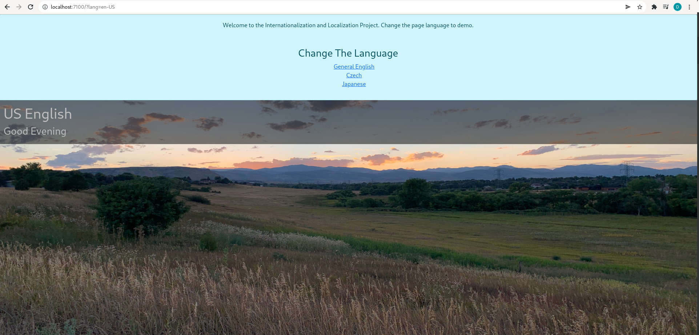
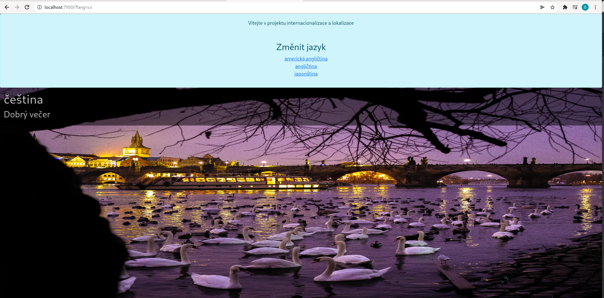
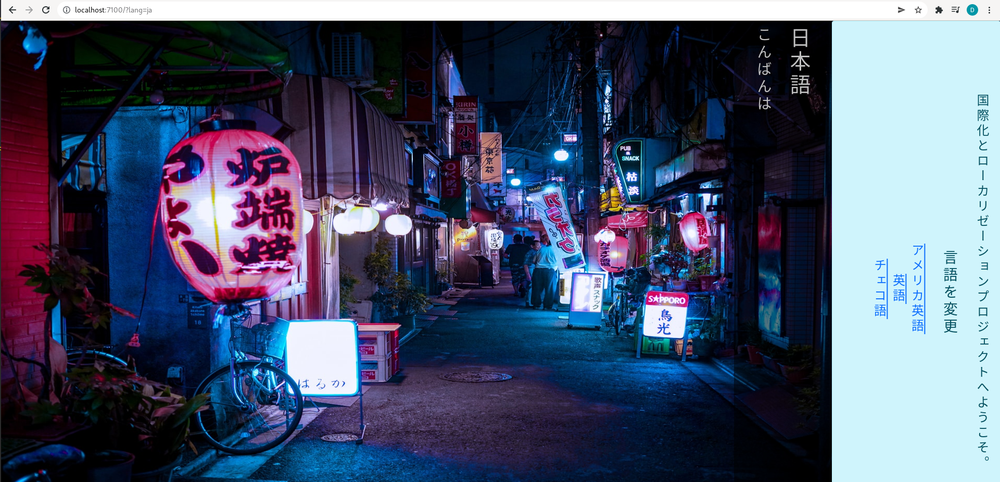

# InterLoc Project - Internationalization & Localization
## Purpose
Project showcases detecting a user's locale and serving the specified translation for a given page.
Quick delve into the differences between internationalization and localization, as well as strategies and patterns
that make an app more likely to be extensible towards localization.

Localization is **NOT** simply rendering a page into multiple languages. It is as nuanced as language itself.
Not every app will need to be localized. Localization is the process of adapting an existing website to a specified
language and culture.

The [standards for Internationalization & Localization](https://www.w3.org/International/questions/qa-i18n) have been 
set by W3C.

## Steps To Demo

    git clone https://github.com/troveofgems/interLoc.git
    cd interLoc
    yarn install
    yarn start
    Open URL http://localhost:PORT
----------------------------------------------------

## Demo Previews





## Detecting A User's Locale via Client-Side

Copy and paste the code from the block below into the console of a browser client.

```javascript
if (navigator.browserLanguage) { // For IE. Yuck
  console.log(`Browser Language Set In IE: ${navigator.browserLanguage}`);
} else if (navigator.language) { // All other sensible clients
  let browserLanguage = navigator.language;
  let browserLanguageList = navigator.languages;
  
  console.log(`Browser Default Language: ${browserLanguage}`);
  console.log(`Acceptable Language Renderings For Browser: ${browserLanguageList}`);
}
```

When the code is run you'll see output similar to below (taken from Mozilla FireFox):


Generally it's difficult to determine a locale and precedentially ordered language list from the client-side, 
so the server should be set to the task of determining the webpage/app visitor's language locales.

## Detecting A User's Locale via Server-Side

An express server has been set-up in this project which contains code to extract the following req header
that involves browser locales and language settings:

Applicable Header: __'Accept Language'__

Review the code in the server.js file, then run the project:
`yarn start`

Navigate to the port specified; you should see output similar to what is below:


Explore this concept by adding and removing languages to your browser and re-rendering the express route.

--------------------------

## Preparing an Application For Internationalization and Localization
To prep a webpage or application for Internationalization and Localization features, use
this general checklist to get started:
1. Determine a list of locales that the webpage or application should support.
   1. In this example we support [en-US, en, cs, and ja] or [US English, Common English, Czech, and Japanese].
2. Create the necessary folder and file structure in the project directory.
   1. /locales directory
      1. JSON files that hold translation key-value pairs to be consumed by the i18n middleware.
         1. Create a <langCode.json> file for every language supported and include translations for each
field type that contains text in the application. This is a very manual process at the moment. Do not rely on Google 
Translate yet as the tech is not smart enough to detect linguistic nuance (Consider Czech's 7 grammatical cases or 
mistranslations of chinese/japanese kanji).
   2. /middleware/i18n.middleware.js
      1. Express middleware should import the i18n package and set the configuration options to:
         1. Support all intended locales
         2. Set the i18n library directory to the /locales directory of the project
         3. Set a default locale
         4. Rename the __ API method to "translate"
         5. Add a URL query parameter override. Label: lang
      2. Initialize the middleware with the configured options
      3. Apply the middleware to the express application
3. Determine a browser's currently set locale preference.
4. Add the functionality to allow URL overrides of the rendered page language.

------------------------------

## Design Patterns & Considerations
### RTL 
Some languages are read right-to-left. The html tag `dir=ltr|rtl|auto` controls the flow of text
written to an HTML document. When localizing for RTL, research should be done for appropriately facilitating
a mirror image layout. Never rely on CSS alone as if the file fails the load, the content will not be aligned 
correctly. Ensuring the `dir` attribute is set on the html or content ensures a safe fallback in instances where css 
may fail.

### URL Localization
When visiting a localized site, the user should expect to see the site rendered in their preferred browser-set 
language, assuming that the language is defined as one of the supported localizable options, or in one of the preferred,
language lists also set by the user and browser if the first preference is not supported.

The user should also be able to override the locale auto-detection by using a request query parameter
to control in which language the site should be rendered. 

### Partial Localization
It's bad, and confusing for the user. Hide any partial localizations until it's been fully translated and hooked-in.

### Images
Don't use images that include text.  Superimpose css text over images if necessary.

### Dates, Numbers, Currencies
Do your research and implement a culturally appropriate format for all dates, numbers, and currencies.

--------------------------------

Resources

1. [Language Direction Table](https://www.w3.org/International/questions/qa-scripts.en#directions)
2. [Detecting Locale](http://www.mattzabriskie.com/blog/detecting-locale)
3. [Localization](https://frontend.turing.edu/lessons/module-4/localization.html)