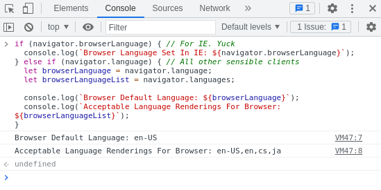
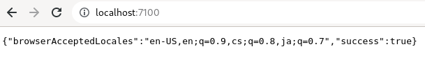

# InterLoc Project - Internationalization & Localization
## Purpose
Project showcases detecting a user's locale and serving the specified translation for a given page.
Quick delve into the differences between internationalization and localization, as well as strategies and patterns
that make an app more likely to be extensible towards localization.

Localization is **NOT** simply rendering a page into multiple languages. It is as nuanced as language itself.
Not every app will need to be localized. Localization is the process of adapting an existing website to a specified
language and culture.

The [standards for Internationalization & Localization](https://www.w3.org/International/questions/qa-i18n) have been 
set by W3C.

----------------------------------------------------

## Detecting A User's Locale via Client-Side

Copy and paste the code from the block below into the console of a browser client.

```javascript
if (navigator.browserLanguage) { // For IE. Yuck
  console.log(`Browser Language Set In IE: ${navigator.browserLanguage}`);
} else if (navigator.language) { // All other sensible clients
  let browserLanguage = navigator.language;
  let browserLanguageList = navigator.languages;
  
  console.log(`Browser Default Language: ${browserLanguage}`);
  console.log(`Acceptable Language Renderings For Browser: ${browserLanguageList}`);
}
```

When the code is run you'll see output similar to below (taken from Mozilla FireFox):


Generally it's difficult to determine a locale and precedentially ordered language list from the client-side, 
so the server should be set to the task of determining the webpage/app visitor's language locales.

## Detecting A User's Locale via Server-Side

An express server has been set-up in this project which contains code to extract the following req header
that involves browser locales and language settings:

Applicable Header: __'Accept Language'__

Review the code in the server.js file, then run the project:
`yarn start`

Navigate to the port specified; you should see output similar to what is below:


Explore this concept by adding and removing languages to your browser and re-rendering the express route.

--------------------------

## i10n & i18n
i18n - Internationalization
i10n - Localization


------------------------------

## Preparing an Application For Internationalization and Localization

To start, we should:
1. Determine a list of locales that the webpage or application should support.
2. Creation and **MANUAL** Maintenance of translation files for the application.
3. Determine a browser's currently set locale preference.
4. Add the functionality to allow URL overrides of the rendered language.

--------------------------------

Resources

[Language Direction Table](https://www.w3.org/International/questions/qa-scripts.en#directions)